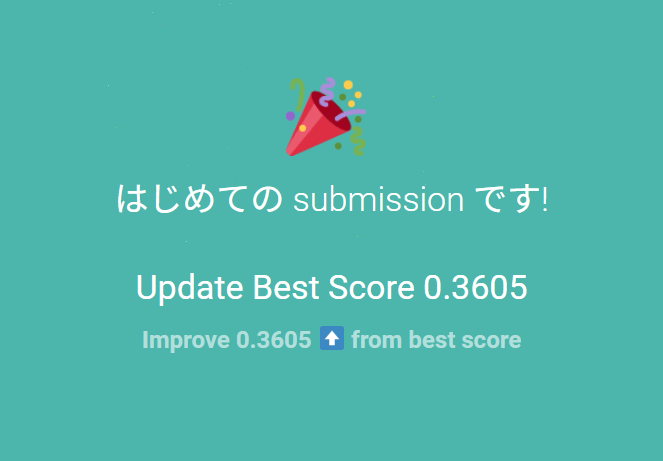

# atmaCup #16 in collaboration with RECRUIT

# お題

リクルートのサービスである国内最大級の旅行予約サイト『じゃらんnet』の実データでセッション内の行動ログから、予約する宿を予測してもらいます（Session-Based Recommendation）

学習用データとしてある予約のセッションの様子とその予約結果が与えられますので、テストデータへの予測の際には、そのセッションの振る舞いや宿の属性等から、どの宿が予約されるか？を予測してください。

利用するデータや課題の詳しい説明・提出ファイル (submission file) の作成方法についてはデータタブから確認をしてください。

- Train / Testの分割方法: 時系列で分割されていて、TestはTrain期間より後に発生したセッションです。
- Public / Privateの分割方法: Testデータをランダムに分割しています。Public : 25% / Private : 75% です。

# 評価方法

MAP@10

$N$番目の予測が正しかった場合のスコアが$1/N$になる（1-indexed）

# データの説明

## train / test_log.csv

学習 / テスト用の期間に対するあるセッションごとに出現した宿を記録したログデータです。seq_noが見た順番を表します。

- session_id: セッションごとに割り振られたユニークなID.

### 補足

連続した同じ宿が出現する場合それらは1つの宿IDにまとめていることに注意してください。
セッション内で最後に出現する宿は必ず正解ラベルとは異なる宿となります。これは現在閲覧している宿とは違う宿をレコメンドしたいというニーズのためです。

## train_label.csv

学習データのセッションが最終的にどの宿を予約したかを記録したcsvファイルです。

- session_id: セッションごとに割り振られたユニークなID.
- yad_no: 予約した宿ID

## yado.csv

宿に関する属性情報が記録されたcsvファイルです。

yad_no: 宿ごとに割り振られたユニークなID
以下は宿の属性に関する情報です。

- yad_type : 宿泊種別（lodging type）
- total_room_cnt : 部屋数（total number of rooms）
- wireless_lan_flg : 無線LANがあるかどうか（wireless LAN connection）
- onsen_flg : 温泉を有しているかどうか（flag with hot spring）
- kd_stn_5min : 駅まで5分以内かどうか（within 5 minutes walk from the station）
- kd_bch_5min : ビーチまで5分以内かどうか（within 5 minutes walk to the beach）
- kd_slp_5min : ゲレンデまで5分以内かどうか（within 5 minutes walk to the slopes）
- kd_conv_walk_5min : コンビニまで5分以内かどうか（within 5 minutes walk to convenience store）

以下は宿の場所に関する情報です。「広域」から「小エリア」は階層構造になっています。（ex: 広域エリアには複数の県が紐づくが、1つの県に対しては1つの広域エリアのみが紐づく）

- wid_cd : 広域エリアCD（wide area CD）
- ken_cd : 県CD（prefecture CD）
- lrg_cd : 大エリアCD（large area CD）
- sml_cd : 小エリアCD（small area CD）

## image_embeddings.parquet

宿ごとに設定された画像の埋め込み結果です。

- yad_no: 宿No
- category: 画像の種類
- emb_0 ~ emb_511: 対応する画像埋め込み結果

## sample_submission.csv

サンプルの提出 (submission) ファイルです。今回のコンペティションではテストデータと同じ並び順に予測ラベルを10件紐付けて予測してください。

- predict_0 ~ predict_9: 予測した宿No.0がもっとも予測確度の高い宿でIndexの数字が大きくなるにつれて確度が下がるようにしてください。

## test_session.csv

提出用ファイルのセッションの並び順を表しているファイルです。test_log.csvに出現するすべてのsession_idを名前順にソートして作成されています。

予測ファイルを作成する場合にはこのセッションの並びと同じ様に予測ラベルを作成してください。

# 目標

- メダル圏内
- DataFrameには``polars``をつかう
    - いずれ流行するんだったら今から覚えよう
    - 特段pandasが手になじんでいる訳でもないし

# 日記

# 12/14

クッソ遅れたけど今から始める。

[はじめてのサブミット](https://github.com/Memories-of-Sun-and-Moon/atmacup16/issues/1)を読んだ。出現した宿をサブミットしたら``LB:0.2893``でたというもの。

train_log.csvなんだけど、$|seq|=1$のデータは、「宿Aを見た（$seq\_no = 0$）」→「宿Bを予約した」って感じなのかな。自信がない。

とにかくEDAをしてみることから始める。

[train/test_logをサクッとEDA](https://github.com/Memories-of-Sun-and-Moon/atmacup16/issues/3)

> train_log.csvなんだけど、$|seq|=1$のデータは、「宿Aを見た（$seq\_no = 0$）」→「宿Bを予約した」って感じなのかな。自信がない。

そういう認識でよさそう。

## やったこと

- 問題概要をここに写す
- MAP@10について深堀する
- 001_eda.ipynb

# 12/15

コンペ2日目です。後れを取りすぎているので、積極的に頑張りたいところ。

[#1 初心者向け講座 データと課題を理解してSubmitする!](https://github.com/Memories-of-Sun-and-Moon/atmacup16/issues/4)

をやった。

[#2 初心者向け講座 モデルを改善する](https://github.com/Memories-of-Sun-and-Moon/atmacup16/issues/5)

をみた。
- ``wid_cd`` が異なるものを候補集合に出すのは意味がなさそう
    - 99.5 % で一致している

- 1回も出現していない宿もある（そりゃそうか）

メモリ不足でjupyter notebookが落ちる。もうちょっと拡幅してあげねば。

24GBにしてきた。22.2GBくらい使って耐えた。

たえたけど、ときどきクラッシュするシーンが増えてきたから、オンプレ（言葉の使い方あってるかな）で機械学習をするのはあまりよくないのかもしれない。

LightGBMの直前までは実装できた。けれど、"session_id" ってどうやって扱えばいいのかな？

困ったからdropさせたのに、また復活したりと大変大変。

# 12/16

よくわからないまま時間だけが経つ。

やっとわかった。画像とがっちゃんこさせるときに、"max_session_yad_id"なるデータを混入させていたみたい。ちゃんと各データを追うべきだった。

今更だけど、polarsでやるのやめないか？

やめた。提出した。

スコア出るの早すぎ。ところで上位15%は0.42前後だそう。敷居高いなぁ。あとは明日の本気に任せるしかない（夜も遅いし）。

# 12/17

いつの間にか最終日（始めるのが遅かったし、何よりもこんなに作業量が多いとは思わなかったよ）。できる限りのことはやろう。

nb003の圧縮版も作った（nb004）。

nb004,005から派生して、cdを全部使うものを作った（nb006）。

提出した。Public Score:0.3603（微減）

要素が増えて学習効率が落ちたのかな。とりあえずそのままにしておこう。

ヒット率について、nb005で考察してみた。ken_cdの上位30個じゃ候補は全然拾えてなく、[#5]にもある通り、大エリアだけではなく小エリアも加えてあげるのがよさそう。

とりあえず、「ken_cd top 30」「lrg_cd top 100」「sml_cd top 50」を特徴に含めてみたい。

今の実装でそれらを全部含めるとテーブルが膨大になってしまうことが判明。「lrg_cd top 50」を採用。

色々諦めて
- wid_cd情報を含めない
- 画像を8次元に圧縮
作業をした。（メモリが足りないよー）

oof score:0.311, Public Score: 0.3991

ほめてもらえた！

画像がデカすぎるだけ説あるので、画像以外を諦めない設計のものを動かしてみる。

学習終わった。

oof score:0.3118, Public Score: 0.3992

微増ですか。てかほんとに微々たる差でかなしい。

- 見た宿の種類数を特徴量に入れる
    - とくに、2以上か否かに注目してみる

これを試したけど、oof=0.3118だったから、ほぼ意味がなさそう。

機械学習を利用しないアプローチが案外好スコアなので、ちょっとそれを活用したい（時間が許せばReRankingとやらも試してみたい！）
併合したやつ（後で詳しく）を作った。Public Score 0.4238

あとはコレとアンサンブルしてみていい記録が出るかどうかのお祈りをしてみましょう

余計下がった。相関がないのをいいことに、なんかうまくいかないかなぁと思ったけれども、そもそもMLアプローチの方の精度が悪いんだろうね。

## TODO

- 小エリアだけじゃなくて、大エリアについても特徴量として入れる

- 提出するファイルに使っている特徴量をまとめる

- スコア計算をする際は、seqの長さ毎にスコアがわかるようにするといいかもしれない

- 画像の枚数を特徴量に入れてみる
    - 掲載画像の集合が、同じものとかがとくにえらばれそうだよね
    - ユーザーはそれがあるかないかで判断しているかも

- アンサンブルするならば、 MAP@20くらいにして、併合するのがよさそう
    - そもそもアンサンブルってどうやってやろうか
    - 最終日に思い切ってもいいものなのだろうか（というか手元のスコアが0.41位になってくれないと、アンサンブルした別モデルのおかげすぎて実質虚無みたいになるのはちょっと気が引けるよね）

## 雑な方針検討メモ

- 宿の数が少ないならば、適当にその地域のオススメ順を提案する
- 行ったり来たりしているならば、最後に見ていない方を提案
    - 逆に、最後に見ている方は（性質上）確実に答えじゃないから省こう

# notebooks

|Number|内容|
|---|---|
|001|trainとtestの差がほぼないことを言っている|
|002|第2回youtubeのnb(polarsで書いて後悔した)|
|003|第2回youtubeのnb(pandasで書いた)|
|004|003のEDAを除いたもの|
|005|各エリアの上位30個を見て、ヒット率を検証する|
|006|宿の情報にwid, lrg, smlも追加|
|007|画像を8次元に、候補としてlrg_top_50を採用|
|008|007の、削除した要素をちょっとだけ戻した|
|009|機械学習を利用しないアプローチ|